# 📦 OpenStack 3Node HA All-in-One Lab
## 📌 Overview

이 프로젝트는 **3노드 기반 OpenStack 고가용성(HA) All-in-One 환경 구축 실습**을 정리한 것이다. <br/>
Pacemaker/Corosync 기반 VIP와 HAProxy를 통해 API 단일 진입점을 구성하고, <br/>
RabbitMQ / Percona XtraDB Cluster / Memcached / etcd를 3노드 클러스터로 배치하여 **컨트롤 플레인 고가용성 구조**를 구현하였다.

또한 Ceph 스토리지를 연동하여 Glance, Cinder, Nova의 주요 데이터 경로를 분산 스토리지 기반으로 구성하였고, <br/>
Neutron 네트워크, Octavia Load Balancer, Masakari Instance HA까지 포함하여 **실제 프라이빗 클라우드 환경에 가까운 아키텍처**를 실습하였다.

단순한 OpenStack 설치가 아니라, 다음과 같은 HA 구성 요소들이 실제로 어떻게 연결되는지 직접 구축하고 검증하는 것을 목표로 한다.

- VIP + HAProxy 기반 API 고가용성
- RabbitMQ / DB / Cache / Coordination 계층 클러스터링
- Ceph 기반 이미지/볼륨/VM 디스크 통합 저장소
- Neutron self-service network 및 provider network 구성
- Octavia 기반 Load Balancer 구성 및 장애 테스트
- Masakari 기반 Instance HA 복구 흐름 확인

---

## 🏗 Architecture

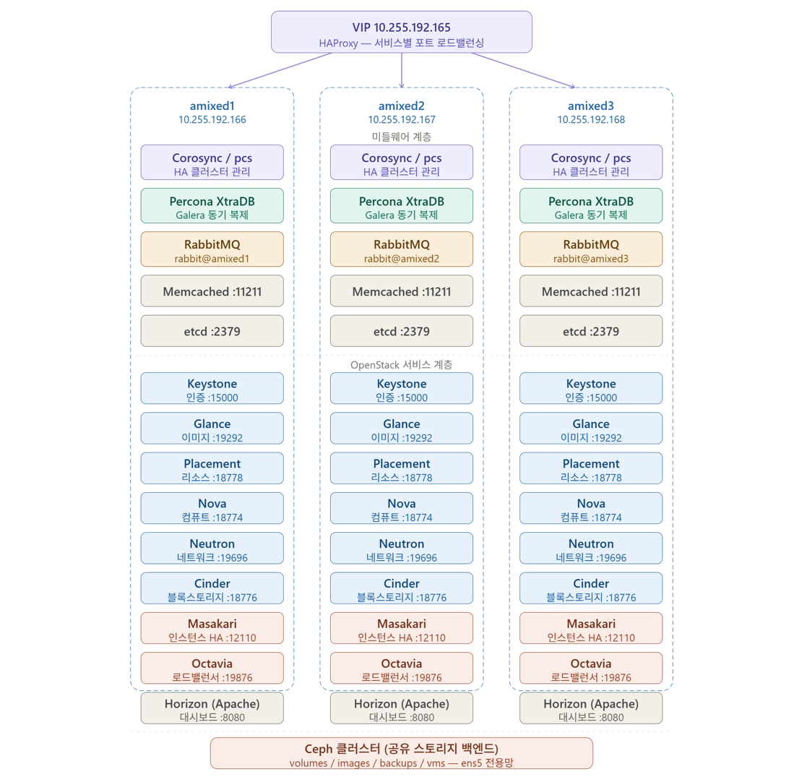
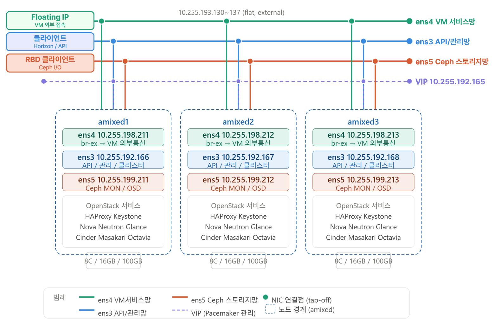

### 핵심 구조
- **Single Entry Point**
  - VIP (`10.255.192.165`)
  - Pacemaker + Corosync
  - HAProxy (OpenStack API Load Balancing)
- **3 Controller Nodes**
  - `node1` / `node2` / `node3`
  - 모든 주요 OpenStack 서비스 Active-Active 구성
- **Internal Clustered Backend**
  - RabbitMQ (3-node cluster)
  - Percona XtraDB Cluster (Galera 기반 DB)
  - Memcached Cluster
  - etcd Cluster
- **Storage**
  - Ceph (MON / MGR / OSD)
  - RBD 기반 (`Glance`, `Cinder`, `Nova`)
- **Network**
  - Provider Network (flat / vlan)
  - Tenant Network (VXLAN)
  - Octavia Management Network (`172.20.0.0/24`)

---

## 🧱 Infrastructure 구성
### 🖥 Nodes

| Hostname	| IP	| Role |
| :--: | :--: | :--: |
| amixed1 |	10.255.192.166 |	Controller |
| amixed2 |	10.255.192.167 |	Controller |
| amixed3 |	10.255.192.168 |	Controller |
| VIP |	10.255.192.165 |	HA Endpoint |

### 공통 기본 설정
- `/etc/hosts`에 VIP 및 각 컨트롤러 노드 등록
- AppArmor / UFW 비활성화
- 내부 apt repository 사용
- OpenStack, Percona, RabbitMQ, Ceph 관련 패키지 설치

---

## ⚙️ HA Cluster
### Pacemaker + Corosync

Pacemaker와 Corosync를 사용하여 3노드 클러스터를 구성하고, VIP를 클러스터 리소스로 관리하였다. <br/>
또한 STONITH 리소스를 구성하여 fencing까지 고려한 형태로 실습하였다.

- VIP 리소스 관리
- HAProxy 리소스 관리
- 노드 장애 시 리소스 이동
- fencing 기반 split-brain 방지 고려

### HAProxy

HAProxy는 OpenStack API의 단일 진입점 역할을 수행한다. <br/>
클라이언트는 각 서비스의 개별 노드 주소가 아니라 VIP를 통해 접근하며, HAProxy가 backend 노드로 트래픽을 분산한다.

- Keystone
- Glance
- Nova
- Neutron
- Placement
- Cinder
- Octavia
- noVNC

---

## 🧩 Backend Cluster
### 🐇 RabbitMQ Cluster

RabbitMQ는 OpenStack 내부 메시지 큐로 사용되며, 3노드 클러스터로 구성하였다.

- Erlang cookie 공유
- `rabbitmqctl join_cluster` 기반 클러스터 구성
- OpenStack 서비스 공통 `transport_url` 사용

### 🐬 Percona XtraDB Cluster (Galera)

DB 계층은 Percona XtraDB Cluster 3노드로 구성하였다. <br/>
Galera 기반 동기 복제를 사용하며, <br/>
Keystone / Glance / Nova / Neutron / Cinder / Placement / Masakari / Octavia DB를 이 클러스터 위에 배치하였다.

**주요 설정**
```
wsrep_cluster_address=gcomm://10.255.192.166,10.255.192.167,10.255.192.168
wsrep_cluster_name=pxc-cluster
binlog_format=ROW
default_storage_engine=InnoDB
wsrep_sst_method=xtrabackup-v2
```

**구현 포인트**
- `node1`에서 bootstrap 수행
- `node2`, `node3`은 join 방식으로 클러스터 편입
- HAProxy를 통해 DB 접근을 VIP 기반으로 단일화

### ✅ 트러블슈팅: SST SSL 인증서 문제

초기 구성 과정에서 `node2`, `node3`가 join 과정에서 timeout이 발생하였다. <br/>
원인은 SST에 필요한 SSL 인증서/키 파일이 node1에만 존재하고, 나머지 노드에 복사되지 않았기 때문이었다.

**해결**

- `ca.pem`, `server-cert.pem`, `server-key.pem` 파일을 `node2`, `node3`로 복사
- MySQL 소유권 및 권한 조정
- 서비스 재기동 후 정상 조인 확인

**추가 경험: Node sync 불일치와 SST 복구**

운영 중 `node2`의 MySQL(PXC) 서비스가 HAProxy stats 상 DOWN으로 표시된 적이 있었다. <br/>
로그 분석 결과, 해당 노드는 클러스터 상태와 크게 벌어진 상태였고 IST 범위를 초과하여 정상 기동하지 못했다. <br/>
이후 donor 노드(`node1`)로부터 **SST(State Snapshot Transfer)** 를 받아 재조인하면서 정상 복구되었다. <br/>
br
이 과정에서 단순한 서비스 다운이 아니라 **Galera 동기화 상태 불일치가 HAProxy health check 실패로 이어질 수 있음**을 확인하였다.

### ⚡ Memcached

Memcached는 Keystone token cache 및 Horizon session backend로 사용하였다.

- 3노드 Memcached cluster 구성
- Keystone 인증 캐시
- Horizon session 공유

### 🧭 etcd

etcd는 분산 coordination store로 구성하였다.

- 3노드 etcd cluster
- 클러스터 초기화 토큰 및 peer/client URL 설정
- Nova / Neutron 연동 기반 환경 구성

---

## 🗄 Storage (Ceph)
### 구성

Ceph는 `cephadm` 기반으로 3노드 클러스터를 구성하였다.

- MON / MGR / OSD 배치
- OpenStack 연동을 위한 pool 생성
- Ceph RBD를 OpenStack backend로 사용

### Pool
- `images`
- `volumes`
- `backups`
- `vms`

### OpenStack 연동
- Glance → `images`
- Cinder → `volumes`, `backups`
- Nova → `vms`

### 구현 포인트

이 구성으로 인해 이미지, 볼륨, 인스턴스 디스크가 각 노드의 로컬 디스크가 아니라 **공유 스토리지(Ceph RBD)** 에 저장되도록 설계하였다. <br/>
이를 통해 인스턴스 라이프사이클과 스토리지 계층을 분리하고, HA 환경과 더 잘 맞는 구조를 만들 수 있었다.

---

## ☁️ OpenStack Services

### 🔐 Identity (Keystone)
- Fernet token 기반 인증 구성
- `fernet-keys`, `credential-keys` 동기화
- VIP 기반 endpoint 사용

### 🖼️ Image (Glance)
- backend: Ceph RBD
- `client.glance` keyring 생성 및 배포
- image upload 및 Ceph 저장 확인

### 📍 Placement
- 리소스 트래킹 전용 API 구성
- Nova 스케줄링 연동

### 🖥️ Compute (Nova)
- nova_api, nova, nova_cell0 DB 분리
- cell0, cell1 구성
- noVNC proxy 연동
- Ceph RBD 기반 VM 디스크 저장

### 🔗 Nova + Ceph 연동 포인트

Nova/libvirt가 Ceph RBD에 직접 접근해야 하므로 다음 작업을 수행하였다.

- `client.cinder` keyring 생성
- 각 노드에 keyring 배포
- `libvirt secret UUID` 등록
- `nova.conf` 에 `rbd_secret_uuid` 반영

즉, Ceph 연동은 단순히 backend를 지정하는 것에서 끝나지 않고, <br/>
**compute 노드에서 libvirt가 Ceph 인증을 수행할 수 있도록 secret까지 등록해야 한다**는 점을 실습을 통해 확인하였다.

### 🌐 Networking (Neutron)
- ML2 + Open vSwitch 구성
- VXLAN tenant network
- external provider network (`br-ex`)
- L3 HA router 구성
- metadata / dhcp / l3 / ovs agent 분산 구성

### 💾 Block Storage (Cinder)
- backend: Ceph RBD
- backup backend: Ceph
- `volumes`, `backups` pool 사용

### ✅ 트러블슈팅: Ceph 권한 문제

초기에는 `cinder-volume`과 `cinder-backup` 서비스가 down 상태가 되었고, <br/>
원인은 Ceph keyring 및 /etc/ceph 디렉터리 권한 문제였다.

**해결**

- `/etc/ceph/ceph.client.cinder.keyring` 권한 수정
- `/etc/ceph/ceph.conf` 권한 수정
- `/etc/ceph` 디렉터리 실행 권한 수정
- 서비스 재시작 후 정상 복구

### 🖥️ Dashboard (Horizon)
- Memcached 기반 session 공유
- Keystone VIP 연동
- Horizon 웹 UI 접근 확인

---

## 🌐 Network Architecture
### Provider Network
- `external (br-ex)`
- flat 또는 VLAN 방식 사용
- Floating IP / 외부 통신 담당

### Tenant Network
- VXLAN 기반 self-service network
- 프로젝트별 네트워크 분리
- Router를 통한 외부망 연결

### 실습용 네트워크 분리

Octavia 테스트를 위해 네트워크를 다음과 같이 분리하여 구성하였다.

- Octavia Management Network
  - `lb-mgmt-net`
  - Amphora 관리 및 health-manager 통신 전용
- Backend Test Network
  - `lbtest-net`
  - backend member(web1, web2) 테스트용
- Self-Service Network
  - 일반 tenant VM 네트워크
  - 실제 사용자 인스턴스용 네트워크

---

## ⚖️ Octavia (Load Balancer)
### 구조

Octavia는 Amphora VM 기반으로 구성하였다.

- Amphora image 직접 생성
- Octavia API / Worker / Health Manager / Housekeeping 구성
- LB management network 별도 분리
- Health-manager 포트 수동 생성 및 OVS 연동

### Management Network
- CIDR: `172.20.0.0/24`
- 각 노드 health-manager IP:
  - `172.20.0.2`
  - `172.20.0.3`
  - `172.20.0.4`
  
### 구성 핵심
- `o-hm0` 인터페이스 생성
- OVS `br-ex` 에 internal port로 연결
- UDP 5555 health check 허용
- Amphora image / flavor 생성
- cert 생성 및 각 노드 배포

### 검증
- listener / pool / member / healthmonitor 생성
- web1 / web2 backend 로드밸런싱 확인
- backend 하나 down 시 나머지 backend만 응답하는지 확인
- backend 복구 후 ONLINE 재편입 확인

### ✅ 트러블슈팅: 삭제 중 `PENDING_DELETE` 고착

LB 삭제 도중 worker 프로세스가 정상 종료되지 못하고 SIGKILL 되면서 TaskFlow가 중간에 끊기는 문제가 발생하였다. <br/>
그 결과 LB가 `PENDING_DELETE` 상태에 고착되고, amphora / port / DB 상태 정리가 비정상적으로 남는 현상을 경험하였다.

이 과정을 통해 Octavia는 단순 API 호출이 아니라 **worker 기반 비동기 TaskFlow로 리소스를 정리**하며, <br/>
**worker 중단이나 DB 불안정이 deletion stuck 상태로 이어질 수 있음**을 확인하였다.

---

## 🛡 Masakari (Instance HA)
### 기능

Masakari는 OpenStack 인스턴스 HA 복구를 위해 구성하였다.

- Instance 장애 자동 복구
- Host / Process / Instance monitoring
- Segment / Host 등록 기반 관리

### 구성 요소
- `masakari-api`
- `masakari-engine`
- `masakari-hostmonitor`
- `masakari-instancemonitor`
- `masakari-processmonitor`

### 동작 흐름
1. 장애 감지
2. Nova 통보
3. 복구 절차 수행
4. Instance 재스케줄링 또는 프로세스 자동 복구

### 검증
- `qemu` 프로세스 강제 종료 후 instance monitor 반응 확인
- `masakari-instancemonitor` 중지 후 process monitor 자동 restart 확인

이 과정에서 process monitor는 즉시 notification을 보내는 것이 아니라, <br/>
먼저 **로컬 복구를 시도하고 복구 실패 시에만 notification API를 발송한다**는 동작 방식도 확인할 수 있었다.

---

## ⏱ Time Sync
### Chrony

- `node1`: 외부 NTP 서버와 동기화
- `node2`, amixed3: amixed1 기준 동기화

HA 환경에서 시간 동기화는 토큰, 인증, 클러스터 통신에 영향을 줄 수 있으므로 필수 구성 요소로 포함하였다.

---

## 🔐 Common Design Principles

- 모든 서비스는 가능한 한 VIP endpoint 를 사용
- 인증/세션 관련 캐시는 Memcached cluster 사용
- 메시지 큐는 RabbitMQ cluster 사용
- DB는 PXC cluster 사용
- 이미지/볼륨/VM 디스크는 Ceph RBD 사용
- 제어 네트워크와 데이터 트래픽 네트워크는 분리
- HA 검증은 단순 서비스 기동 여부가 아니라 장애 상황과 복구 흐름까지 포함하여 확인

---

### 🚀 주요 특징
- 3-node 완전 HA 컨트롤 플레인
- Active-Active API 구조
- DB / MQ / Cache / Coordination 전부 클러스터링
- Ceph 통합 스토리지
- Octavia L4/L7 Load Balancer
- Masakari 기반 Instance HA
- 내부 레포지토리 기반 패키지 관리

---

## ✅ Validation
### ✔ OpenStack Service Status
주요 OpenStack 서비스가 모두 정상적으로 기동되고 API endpoint가 VIP를 통해 제공되는지 확인하였다.

  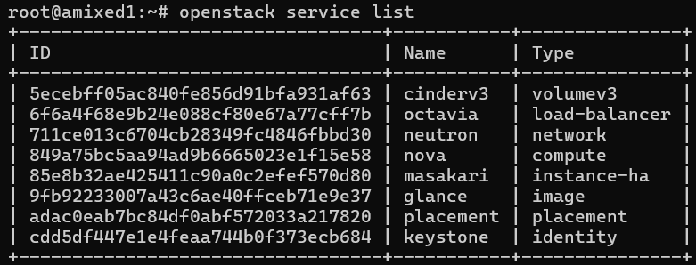
  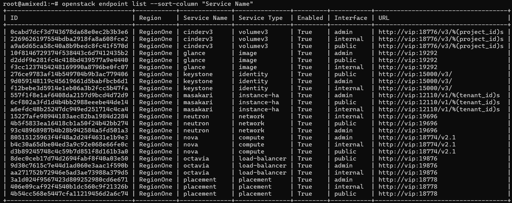
  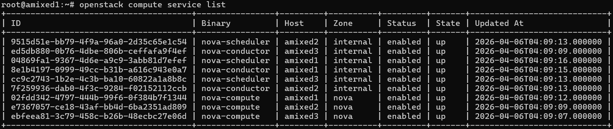

### ✔ HA Verification (VIP + HAProxy)
Pacemaker/Corosync가 VIP를 정상 관리하고, HAProxy가 OpenStack API를 backend node로 올바르게 분산하는지 확인하였다.

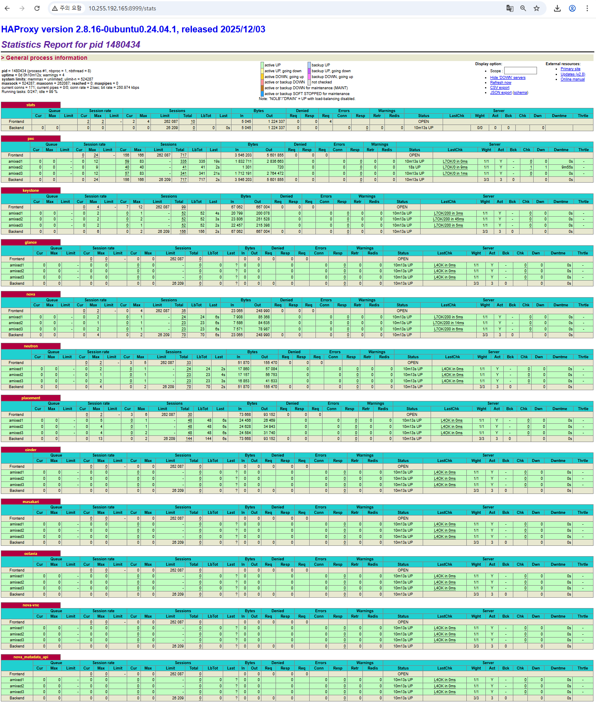

### ✔ Database Cluster (PXC)

PXC 3노드가 모두 Primary Component에 포함되어 있고, 각 노드가 Synced / Ready 상태인지 확인하였다.

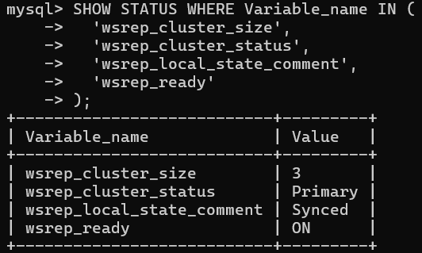


### ✔ Network
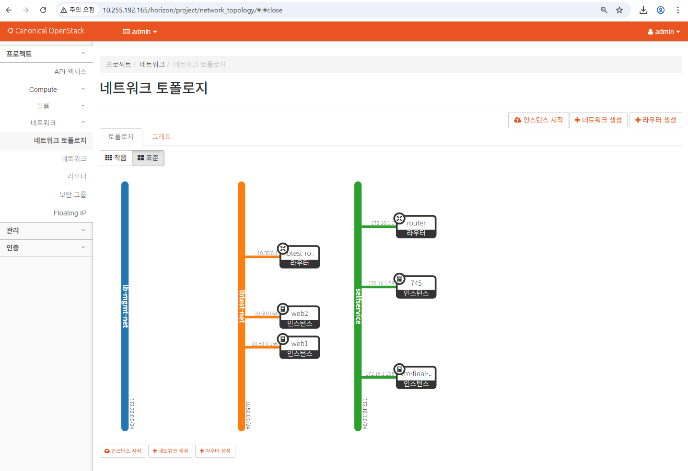

### ✔ Ceph Storage

Ceph cluster health와 OSD 상태, OpenStack 연동 backend 상태를 확인하였다.

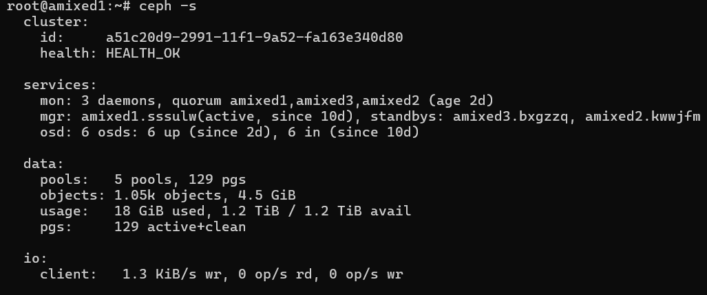
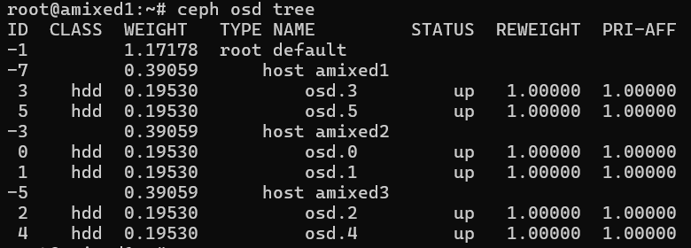
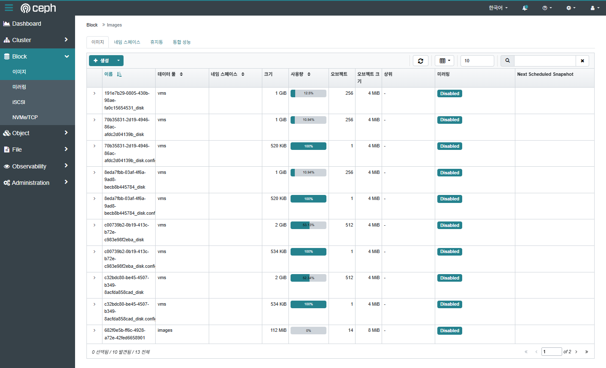

### ✔ Load Balancer (Octavia)

Octavia를 통해 생성한 Load Balancer가 backend member(web1, web2)로 정상 분산되는지 검증하였다.

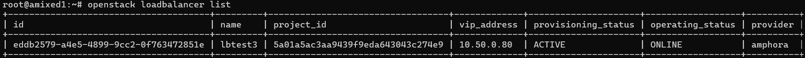
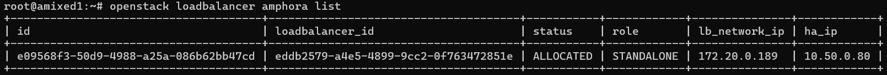
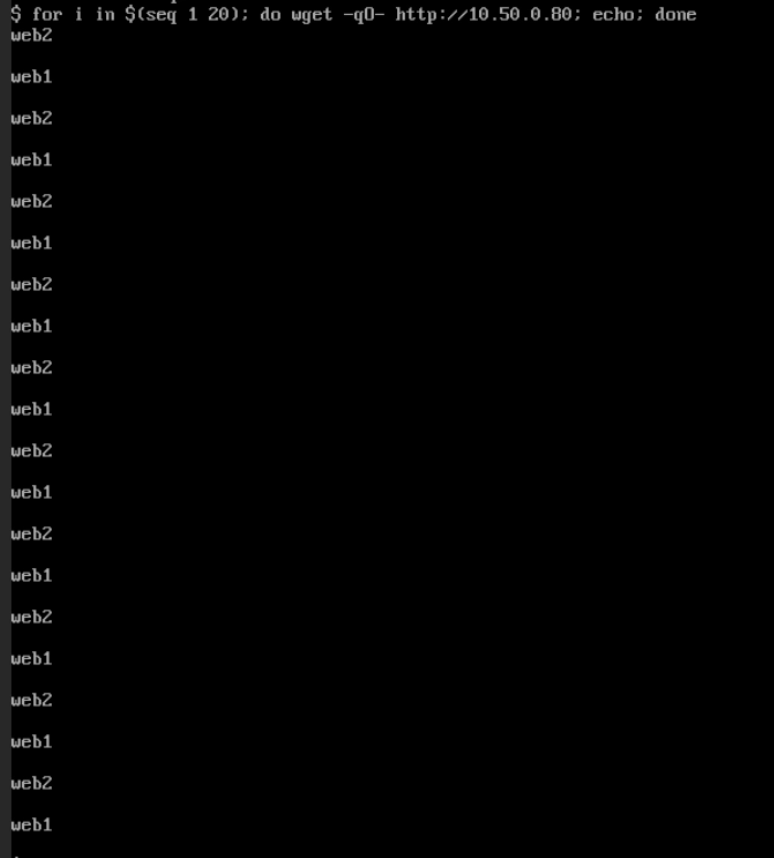

---

### 📊 Troubleshooting Summary

| 문제                  | 원인                          | 해결                 |
| :------------------ | :-------------------------- | :----------------- |
| PXC join 실패         | SST용 SSL 인증서 미존재            | 인증서 복사 및 권한 수정     |
| Glance ↔ Ceph 인증 실패 | `client.glance` keyring 미설정 | keyring 생성 및 배포    |
| Cinder 서비스 down     | Ceph keyring / 디렉터리 권한 문제   | 권한 수정 후 재시작        |
| API 연결 실패           | VIP endpoint 미사용            | endpoint 및 conf 수정 |
| Octavia 통신 실패       | `o-hm0` 미구성                 | 인터페이스 생성 및 OVS 연결  |
| PXC backend DOWN    | 클러스터 상태 불일치, SST 필요         | 노드 재조인 및 SST 수행    |
| Octavia LB 삭제 고착    | worker 중단 및 TaskFlow 미완료    | 상태 확인 및 수동 정리      |


---

## 🚀 Key Takeaways

**실제 고가용성 아키텍처를 구성할 때 어떤 계층들이 서로 의존하는지를 체계적으로 이해**할 수 있었다.

- Galera/PXC가 단순 DB가 아니라 **클러스터 상태 동기화**가 핵심이라는 점
- VIP + HAProxy + backend cluster가 OpenStack API HA의 기본 패턴이라는 점
- Ceph 연동 시 단순 backend 설정뿐 아니라 **keyring / libvirt secret / 권한**까지 중요하다는 점
- Octavia는 worker 기반 비동기 TaskFlow 구조라서 **삭제 및 상태 전이가 꼬일 수 있다는 점**
- Masakari monitor가 단순 알림이 아니라 **복구 우선 정책**을 가진다는 점

---

## 🧠 Retrospective

- OpenStack 서비스 간 의존성 이해
- HA 아키텍처 설계 및 검증 경험
- Galera / RabbitMQ / Memcached / etcd / Ceph 클러스터 구성 경험
- Neutron / Octavia 네트워크 흐름 이해
- 장애 상황에서 로그를 통해 원인을 추적하고 복구하는 경험
