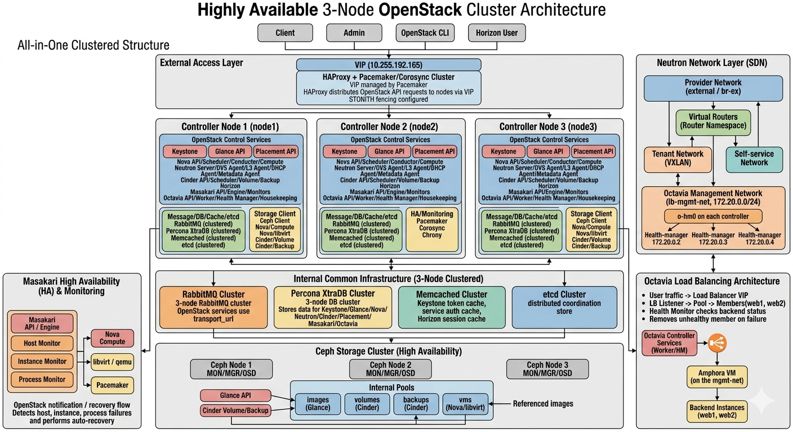

# 📦 OpenStack 3-Node All-in-One HA Lab

## 📌 Overview

이 프로젝트는 **3노드 기반 OpenStack 고가용성(HA) All-in-One 환경 구축 실습**을 정리한 것이다.
Pacemaker/Corosync 기반 VIP, HAProxy 로드밸런싱, 그리고 RabbitMQ / Percona XtraDB / Memcached / etcd 클러스터를 포함한 **컨트롤 플레인 완전 이중화 구조**를 구현하였다.

또한 Ceph 스토리지, Neutron 네트워크, Octavia Load Balancer, Masakari Instance HA까지 포함하여
**실제 프라이빗 클라우드 수준의 아키텍처**를 구성하였다.

---

## 🏗 Architecture



**핵심 구조**
- **Single Entry Point**
  - VIP (10.255.192.165)
  - Pacemaker + Corosync
  - HAProxy (API Load Balancing)
- **3 Controller Nodes**
  - node1 / node2 / node3
  - 모든 주요 OpenStack 서비스 Active-Active 구성
- **Internal Clustered Backend**
  - RabbitMQ (3-node cluster)
  - Percona XtraDB Cluster (Galera 기반 DB)
  - Memcached Cluster
  - etcd Cluster
- **Storage**
  - Ceph (MON / MGR / OSD)
  - RBD 기반 (Glance, Cinder, Nova)
- **Network**
  - Provider Network (flat / vlan)
  - Tenant Network (VXLAN)
  - Octavia Management Network (172.20.0.0/24)

---

## 🧱 Infrastructure 구성
### 🖥 Nodes

| Hostname	| IP	| Role |
| :--: | :--: | :--: |
| amixed1 |	10.255.192.166 |	Controller |
| amixed2 |	10.255.192.167 |	Controller |
| amixed3 |	10.255.192.168 |	Controller |
| VIP |	10.255.192.165 |	HA Endpoint |

---

## ⚙️ HA 구성
### Pacemaker + Corosync
- VIP 관리
- STONITH 기반 fencing 고려
- 단일 진입점 제공
### HAProxy
- OpenStack API Load Balancing
- 모든 서비스는 VIP 기반 접근

---

## 🧩 Backend Cluster
### RabbitMQ Cluster
- OpenStack messaging backbone
- Erlang cookie 공유 기반 cluster 구성
### Percona XtraDB Cluster (Galera)
- 3-node Active-Active DB
- wsrep 기반 동기화
**주요 설정**
```
wsrep_cluster_address=gcomm://10.255.192.166,10.255.192.167,10.255.192.168
wsrep_cluster_name=pxc-cluster
binlog_format=ROW
```

**⚠️ 트러블슈팅 (SSL 인증서)**
- 문제: 노드 join 실패 (timeout)
- 원인: SST SSL 인증서 미존재
- 해결:
  - node1에서 생성된 인증서 복사
  - 권한 수정 후 재기동
 
### Memcached
- Keystone token cache
- Horizon session cache
### etcd
- 분산 coordination store
- 주로 Nova / Neutron 내부 상태 관리

---

## 🗄 Storage (Ceph)
### 구성
- cephadm 기반 배포
- MON / MGR / OSD 구성
### Pool
- images
- volumes
- backups
- vms
### OpenStack 연동
- Glance → images
- Cinder → volumes
- Nova → vms

---

## ☁️ OpenStack Services
### Identity (Keystone)
- Fernet token 방식
- key rotation을 위한 key sync 구성
### Image (Glance)
- backend: Ceph RBD
- keyring 기반 인증 필요
### Placement
- 리소스 트래킹
### Networking (Neutron)
- ML2 + Open vSwitch
- VXLAN tenant network
- L3 HA Router 구성
### Dashboard (Horizon)
- Memcached 기반 session 공유

---

## 🌐 Network Architecture
### Provider Network
- external (br-ex)
- flat 또는 VLAN
### Tenant Network
- VXLAN 기반 overlay

---

## ⚖️ Octavia (Load Balancer)
### 구조
- Amphora VM 기반 LB
- Health Manager 분산 구성
### Management Network
- CIDR: 172.20.0.0/24
- 각 노드:
  - 172.20.0.2
  - 172.20.0.3
  - 172.20.0.4
### 구성 핵심
- o-hm0 인터페이스 생성
- OVS br-ex 연결
- health check (UDP 5555)

---

## 🛡 Masakari (Instance HA)
### 기능
- Instance 장애 자동 복구
- Host / Process / Instance monitoring
### 동작 흐름
1. 장애 감지
2. Nova 통보
3. Instance 재스케줄링

---

## ⏱ Time Sync
### Chrony
- node1: external NTP
- node2/3: node1 sync

---

## 🔐 공통 구성
- Memcached cluster
- RabbitMQ cluster
- DB VIP 기반 접근
- 모든 서비스는 VIP endpoint 사용

---

### 🚀 주요 특징
- 3-node 완전 HA 컨트롤 플레인
- Active-Active API 구조
- DB / MQ / Cache / Coordination 전부 클러스터링
- Ceph 통합 스토리지
- Octavia L4/L7 Load Balancer
- Masakari 기반 Instance HA
- 내부 레포지토리 기반 패키지 관리

---

### 📊 트러블슈팅 요약
| 문제	| 원인	| 해결 |
| :--: | :--: | :--: |
|PXC join 실패	| SSL 인증서 없음 | 인증서 복사 및 권한 수정 |
|Ceph 인증 실패	| keyring 미설정	| client.glance 생성 |
|API 연결 실패	| VIP 미사용 |	endpoint 수정 |

---

## 🧠 회고 (Optional)

- Galera cluster 동작 이해
- OpenStack 서비스 간 의존성 이해
- HA 구성 시 “VIP + Backend cluster” 패턴 체득
- Ceph + OpenStack 연동 경험
- Octavia/Neutron 네트워크 흐름 이해
- Octavia 통신 실패	o-hm0 미구성	인터페이스 생성
